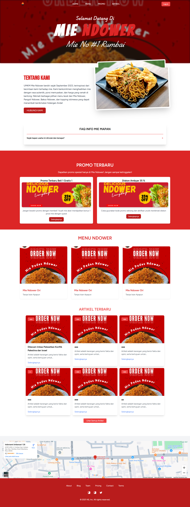

## BAB I Pendahuluan

## 1.1 Tujuan

Dokumen Software Requirement Specification (SRS) merupakan dokumen spesifikasi perangkat lunak untuk membangun “Sistem Informasi Parenting”. Dokumen ini dibangun untuk memudahkan Dinas Perlindungan Anak memberikan informasi dan edukasi terkait Ilmu Parenting kepada calon orang tua dan para orang tua. Sehingga dokumen ini dapat dijadikan acuan teknis untuk membangun perangkat lunak “SISTEM INFORMASI PARENTING”.

## 1.2 Lingkup
Sistem Informasi Parenting merupakan aplikasi yang kami bangun untuk mempermudah Dinas Perlindungan Anak dalam memberikan infromasi dan edukasi kepada para calon orang tua dan orang tua seputar Ilmu Parenting seperti perkembangan anak, kesehatan anak, pendidikan anak, kesejahteraan mental anak, dan lain-lainnya.

## 1.3 Akronim, singkatan, definisi
| Istilah | Definisi |
| ------ | ------ |
|   SRS     |    Software Requirement Specification    |
|    Login    | Digunakan untuk mengakses aplikasi       |
|   Software Requirement Specification     | perangkat lunak yang akan dibuat dan sebagai penyembatani komunikasi pembuat dengan pengguna       |
|    Use Case    | situasi dimana sistem anda digunakan untuk memenuhi satu atau lebih kebutuhan pemakaian anda       |
|    Use Case    | situasi dimana sistem anda digunakan untuk memenuhi satu atau lebih kebutuhan pemakaian anda       |
|    Use Case    | situasi dimana sistem anda digunakan untuk memenuhi satu atau lebih kebutuhan pemakaian anda       |

## 1.4 Referensi
Referensi yang digunakan dalam pengembangan perangkat lunak ini adalah :

-https://schoolofparenting.id/

## 1.5 Overview
Bab selanjutnya yaitu menjelaskan sistem yang di terapkan pada aplikasi. Menjelaskan gambaran umum dari aplikasi, sistem interface aplikasi dan alur sistemnya. Bab terakhir menjelaskan tentang setiap fungsi yang digunakan secara teknisnya. Pada bab 2 dan 3 merupakan deskripsi dari aplikasi yang akan diterapkan pada aplikasi yang dibuat.

## BAB II GAMBARAN UMUM
UMKM adalah tulang punggung perekonomian masyarakat, dan di tengah pesatnya perkembangan teknologi di era globalisasi ini, sektor UMKM terus beradaptasi untuk bertahan dan berkembang. Salah satu inovasi penting adalah pemanfaatan teknologi, khususnya di bidang software engineering, yang dapat membantu meningkatkan efisiensi dan daya saing UMKM dalam kehidupan sehari-hari.

Dalam studi kasus ini, kami menganalisis kebutuhan UMKM Mie Ndower yang telah berdiri sejak September 2023 di Pekanbaru. UMKM ini terinspirasi dari kecintaan pemiliknya terhadap mie, dan hadir dengan cita rasa khas yang unik dan menggugah selera. Tantangan utama yang kami temui adalah bagaimana memberikan informasi lengkap dan akses mudah kepada pelanggan terkait produk, promo, lokasi, dan berbagai hal tentang Mie Ndower.

Maka dari itu, kami merancang sebuah sistem informasi berbasis web, sebuah platform modern yang dirancang untuk membantu UMKM Mie Ndower dalam memberikan pengalaman terbaik kepada pelanggannya. Sistem ini dilengkapi dengan berbagai fitur yang dapat membantu pengunjung dan admin dalam mengelola serta mendapatkan informasi seputar Mie Ndower, pengunjung fungsi utama yaitu:

- View Menu
- View Promo
- View Artikel
- View FAQ
- View About
- View Locations
- View Contact
- Input Reviews

Berikut ini fungsi admin yaitu:
- Login
- Input, Edit, Delete Menu
- Input, Edit, Delete Promo
- Input, Edit, Delete Artikel
- Input, Edit, Delete FAQ
- Input, Edit, Delete About
- Input, Edit, Delete Locations
- Manage Reviews
  
## 2.1 Perspektif produk
Web Profile Mie Ndower adalah sebuah sistem informasi yang diaplikasikan pada website. Terdapat 2 jenis aktor yaitu admin dan pengunjung. Pengolahan data dilakukan oleh admin pada website, sedangkan pengunjung hanya dapat melihat informasi yang telah disediakan pada website.

**2.1.1 Antarmuka Sistem**

Sistem Informasi Parenting memiliki 2 pengunjung yaitu admin dan pengunjung. Admin mempunyai fungsi mengelola data informasi dan Pengunjung bisa melihat informasi serta memberikan komentar.

**2.1.2 Antarmuka Pengguna**

**Halaman Admin**
|  |  |
|--|--|
|  halaman login admin diminta untuk mengisi username dan password.|  Setelah login admin akan masuk ke tampilan Dashboard admin.
|  |  |
|  Pada halaman admin akan terdapat halaman unutk mengelola data menu, namun tidak hanya data menu tapi admin juga dapat mengelola data artikel, data kontak, data about, data hompegae, data faq, dan data promo  dengan tamnpilan yang sama di halaman yang berbeda.|  Pada halaman mengelola data menu, admin juga dapat menambahkan data menu, begitu juga dengan pengelolaan data di tabel lainnya.
|  |  |
|  Pada halaman mengelola data menu juga terdapat aksi untuk mengedit data menu.| Pada halaman mengelola data kegiatan, selain menambahkan dan mengedit, admin juga dapat menghapus data menu yang mana ketika button hapus di klik akan muncul pop up untuk memastikan admin benar-benar ingin menghapus atau tidak.

**Halaman User**
|  |  |
|--|--|
|  Pada halaman pengunjung terdapat beranda yang berisi tampilan scrolling yang berisi seluruh konten seperti tampilan home, about, faq,promo,menu, artikel ,locations dan contact.| Pada halaman pengunjung terdapat halaman menu yang berisi nama_menu, gambar, deskripsi, rating dan harga.
|  |  |
|  Pada halaman pengunjung terdapat halaman lanjutan menu, jika pengunjung telah mengklik satu menu yang akan dilihat, maka pada halaman ini akan tampil review berupa rating dan komentar dari menu tersebut.| Pada halaman pengunjung terdapat halaman promo yang berisi gambar,deskripsi, dan judul  promo.
|  |  |
|  Pada halaman pengunjung terdapat halaman lanjutan Promo jika pengunjung telah mengklik satu promo yang akan dilihat, maka pada halaman ini akan tampil detail dari promo tersebut.| Pada halaman pengunjung terdapat halaman artikel yang berisi gambar,judul,deskripsi dari artikel.
|  |  |
|  Pada halaman pengunjung terdapat halaman lanjutan Artikel jika pengunjung telah mengklik satu artikel yang akan dilihat, maka pada halaman ini akan tampil detail dari artikel dan rekomendasi artikel lain .

**2.1.3 Antarmuka perangkat keras**

Antarmuka perangkat keras yang digunakan untuk mengoperasikan Perangkat Lunak Sistem Parenting antara lain :

PC / Laptop Untuk menjalankan Aplikasi ini.

**2.1.4 Antarmuka perangkat lunak**

tidak ada

**2.1.5 Antarmuka Komunikasi**

Antarmuka komunikasi yang digunakan untuk mengoperasikan Perangkat Lunak Sistem Informasi Parenting antara lain :

- PC

- wifi/Jaringan

**2.1.6 Batasan Memori**

tidak ada

**2.1.7 Operasi-operasi**
| Operasi | Fungsi |
| ------ | ------ |
|   Login  | Digunakan untuk mengakses aplikasi    |
|    Input Data    |    Digunakan untuk memasukkan data-data    |
| Kembali |  Digunakan untuk kembali ke halaman sebelumnya |
| Hapus | Digunakan untuk menghapus data|
| Edit       |   Digunakan untuk mengubah data     |
| View      |   Digunakan untuk menampilkan data     |
| Simpan      |     Digunakan untuk menyimpan data   |

**2.1.1 Kebutuhan adaptasi**

tidak ada

## 2.2 Spesifikasi kebutuhan fungsional
[Gambar/Fungsional.png](https://github.com/saidarkan/UMKM-MieNdower/blob/aff244c1bc847ad9ef2055b7afe60219494df7ad/Gambar/Fungsional.png)

**2.2.1 Admin Login**

Use Case: Login

Diagram:

Deskripsi Singkat 
Admin melakukan login terlebih dahulu sebelum masuk ke tampilan home admin, apabila gagal login akan muncul pesan alert error login. 

Deskripsi Langkah-Langkah
1. Admin melakukan login dengan username dan password.
2. Sistem melakukan validasi login.
3. Bila sukses sistem akan mengarahkan ke home admin.
4. Bila gagal sistem akan menampilkan peringatan.

Xref: Bagian 3.2.1, Login Admin

**2.2.2 Admin Input Artikel Parenting**

Use Case: Input Artikel Parenting

Diagram:

Deskripsi Singkat
Admin menginputkan kategori parenting lalu menambahkan judul dan deskripsi sesuain kategori.

Deskripsi Langkah- langkah:
1. Sistem akan menampilkan tampilan input artikel.
2. Admin Dapat melihat,menambahkan, dan mengupload artikel.
3. Sistem akan menyimpan ke database.
4. Jika sudah disimpan sistem akan menampilkan peringatan.

Xref: Bagian 3.2.2, Input data Artikel Parenting

**2.2.3 Admin Input Dokumentasi kegiatan**

Use Case: Input Dokumentasi kegiatan

Diagram:

Deskripsi Singkat
Sistem dapat menampilkan halaman input dokumentasi kegiatan dan Admin menginputkan dokumentasi kegiatan.

Deskripsi Langkah- langkah:
1. Sistem akan menampilkan tampilan publikasi kegiatan.
2. Admin dapat melihat,menambahkan, dan mengupload kegiatan.
3. Sistem akan menyimpan ke database.
4. sudah disimpan sistem akan menampilkan peringatan.

Xref: Bagian 3.2.3, Input data Dokumentasi kegiatan

**2.2.4 Admin Input data tentang B3AM**

Use Case: Input data tentang B3AM

Diagram:

Deskripsi Singkat
Sistem dapat menampilkan halaman Input data tentang B3AM dan Admin mengInput data tentang B3AM.
Deskripsi Langkah- langkah:
1. Sistem akan menampilkan tampilan data tentang B3AM.
2. Admin dapat melihat,menambahkan, dan mengupload data tentang B3AM.
3. Sistem akan menyimpan ke database.
4. sudah disimpan sistem akan menampilkan peringatan.

Xref: Bagian 3.2.3,data tentang B3AM

**2.2.5 Admin Input data contact B3AM**

Use Case: Input data contact B3AM

Diagram:

Deskripsi Singkat
Sistem dapat menampilkan halaman Input data contact B3AM dan Admin mengInput data contact B3AM.
Deskripsi Langkah- langkah:
1. Sistem akan menampilkan tampilan data contact B3AM.
2. Admin dapat melihat,menambahkan, dan mengupload data contact B3AM.
3. Sistem akan menyimpan ke database.
4. sudah disimpan sistem akan menampilkan peringatan.

Xref: Bagian 3.2.3,data contact B3AM

**2.2.6 Admin Input data team B3AM**

Use Case: Input data team B3AM

Diagram:

Deskripsi Singkat
Sistem dapat menampilkan halaman Input data team B3AM dan Admin mengInput data team B3AM.
Deskripsi Langkah- langkah:
1. Sistem akan menampilkan tampilan data team B3AM.
2. Admin dapat melihat,menambahkan, dan mengupload data team B3AM.
3. Sistem akan menyimpan ke database.
4. sudah disimpan sistem akan menampilkan peringatan.

Xref: Bagian 3.2.3,data team B3AM

**2.2.7 pengunjung Mengunjungi website**

Use Case: Mengunjungi website

Diagram:

Deskripsi Singkat 
pengunjung mengunjungi website dan melihat informasi yang ada pada website seperti informasi seputar website serta informasi parenting yang telah tersedia, pengunjung juga dapat memberikan komentar pada konten parenting yang tersedia 

Deskripsi Langkah-Langkah
1. Sistem akan menampilkan halaman-halaman konten.
2. pengunjung melihat informasi yang ada pada website seperti informasi seputar website atau informasi parenting serta juga dapat memberikan komentar pada konten parenting yang tersedia 
3. pengunjung dapat mengklik tombol kembali ke halaman sebelumnya jika ingin keluar pada halaman konten yang telah dilihat.

Xref: Bagian 3.2.7, Login pengunjung

## 2.3 Spesifikasi kebutuhan non-fungsional
- tabel kebutuhan non-fungsional

| no | deskripsi |
| ------ | ------ |
|     1   |   Semua interface dan fungsi menggunakan Bahasa Indonesia     |
|     2   |   Perangkat Lunak dapat dipakai di semua platofrm OS ( Admin, pengunjung )     |

## 2.4 Karakteristik Pengguna
Karakteristik pengguna dari perangkat lunak ini adalah pengguna langsung berinteraksi dengan sistem dan dihubungkan dengan hak akses atau level autentikasi.

## 2.5 Batasan-batasan
tidak ada

## 2.6 Asumsi-asumsi
tidak ada

## 2.7 Kebutuhan Penyeimbang
tidak ada

## BAB III Requirement Specification

## 3.1 Persyaratan Antarmuka Eksternal
Salah satu cara mengakses website ini yaitu dengan registrasi, setelah registrasi akan login dengan memasukkan username dan password, kemudian sistem akan validasi login. setelah login berhasil pengunjung dapat melihat konten yang ada di website tersebut.

## 3.2 Functional Requirement
**3.2.1 Login Admin**

| Nama Fungsi         | Login                                  |
| ------------------- | -------------------------------------- |
| Xref                | Bagian 2.2.1 Login               |
| Trigger             | Admin Membuka Website Profile Mie Ndower |
| Precondition        | Halaman login                          |
| Basic Path          | 1. Admin melakukan login dengan username dan password.
|        |         2. Sistem melakukan validasi login. |
|        | 3. Bila sukses, sistem akan mengarahkan ke dashboard admin.  |
|        | 4. Bila gagal, sistem akan menampilkan peringatan. |
|     Alternative       |                   Tidak Ada                   |
| Post Condition     |                  admin dapat login dan mengakses webiste profile mie ndower                   |
|         Exception Push          |                  Username dan password salah                   |

**3.2.2 Admin Input Informasi Artikel Parenting**
| Nama Fungsi | Input Informasi Parenting |
| ------ | ------ |
| Xref       | Bagian 3.2.2, Input data artikel parenting       |
| Triger       | Membuka website sistem informasi parenting        |
| Precondition | Menginput data artikel parenting |
| Basic Path | 1. Sistem akan menampilkan tampilan input artikel. |
|            | 2. Admin dapat melihat,menambahkan, dan mengupload kegiatan. |
|            | 3. Sistem akan menyimpan ke database. |
|            | 4. Jika sudah disimpan sistem akan menampilkan peringatan. |
| Alternative | Tidak ada |     
| Post Condition | Admin mengelola artikel
| Exception Push | Tidak ada koneksi |

**3.2.3 Input Dokumentasi Kegiatan**

| Nama Fungsi        | Input Informasi Website                              |
| ------------------- | ---------------------------------- |
| Xref               | Bagian 2.2.3 Admin Input Dokumentasi Kegiatan                     |
| Trigger            | admin dapat menginputkan data Dokumentasi Kegiatan |
| Precondition       | Admin menginputkan Data dokumentasi Kegiatan ke website |
| Basic Path         | 1. Sistem akan menampilkan tampilan publikasi kegiatan. |
|                    | 2. Admin dapat melihat,menambahkan, dan mengupload kegiatan.   |
|                    | 3. Sistem akan menyimpan ke database.   |
|                    | 4. Jika sudah disimpan sistem akan menampilkan peringatan.   |
| Alternative        |  Tidak Ada                                 |
| Post Condition     |  Admin Dapat menginputkan data seputar website seperti alamat, pengelola, dan contact person.        |
| Exception Push     | Tidak Ada        |

**3.2.4 Input data tentang BP3AM**

| Nama Fungsi        | Input Informasi Website                              |
| ------------------- | ---------------------------------- |
| Xref               | Bagian 2.2.4 Admin Input data tentang BP3AM                     |
| Trigger            | admin dapat menginputkan data tentang BP3AM |
| Precondition       | Admin menginputkan data tentang BP3AM ke website |
| Basic Path         | 1. Sistem akan menampilkan tampilan data tentang BP3AM. |
|                    | 2. Admin dapat melihat,menambahkan, dan mengupload data tentang BP3AM.   |
|                    | 3. Sistem akan menyimpan ke database.   |
|                    | 4. Jika sudah disimpan sistem akan menampilkan peringatan.   |
| Alternative        |  Tidak Ada                                 |
| Post Condition     |  Admin Dapat menginputkan data seputar website seperti alamat, pengelola, dan contact person.        |
| Exception Push     | Tidak Ada        |

**3.2.5 Input data contact BP3AM**

| Nama Fungsi        | Input Informasi Website                              |
| ------------------- | ---------------------------------- |
| Xref               | Bagian 2.2.5 Admin Input data contact BP3AM                     |
| Trigger            | admin dapat menginputkan data contact BP3AM |
| Precondition       | Admin menginputkan data contact BP3AM ke website |
| Basic Path         | 1. Sistem akan menampilkan tampilan data contact BP3AM. |
|                    | 2. Admin dapat melihat,menambahkan, dan mengupload data contact BP3AM.   |
|                    | 3. Sistem akan menyimpan ke database.   |
|                    | 4. Jika sudah disimpan sistem akan menampilkan peringatan.   |
| Alternative        |  Tidak Ada                                 |
| Post Condition     |  Admin Dapat menginputkan data seputar website seperti alamat, pengelola, dan contact person.        |
| Exception Push     | Tidak Ada        |

**3.2.6 Input data team BP3AM**

| Nama Fungsi        | Input Informasi Website                              |
| ------------------- | ---------------------------------- |
| Xref               | Bagian 2.2.6 Admin Input data team BP3AM                     |
| Trigger            | admin dapat menginputkan data team BP3AM |
| Precondition       | Admin menginputkan data team BP3AM ke website |
| Basic Path         | 1. Sistem akan menampilkan tampilan data team BP3AM. |
|                    | 2. Admin dapat melihat,menambahkan, dan mengupload data team BP3AM.   |
|                    | 3. Sistem akan menyimpan ke database.   |
|                    | 4. Jika sudah disimpan sistem akan menampilkan peringatan.   |
| Alternative        |  Tidak Ada                                 |
| Post Condition     |  Admin Dapat menginputkan data seputar website seperti alamat, pengelola, dan contact person.        |
| Exception Push     | Tidak Ada        |

**3.2.6 Mengunjungi website**

| Nama Fungsi        |    pengunjung  Mengunjungi website             |
| ------------------- | ---------------------------------- |
| Xref               | Bagian 2.2.6 Pengunjung Mengunjungi website             |
| Trigger            |pengunjung Dapat mengunjungi website dan melihat informasi yang ada pada website seperti informasi seputar website serta informasi parenting yang telah tersedia |
| Precondition       |pengunjung Mengunjungi website |
| Basic Path         | 1. Sistem akan menampilkan halaman-halaman konten. |
|                    |  2.pengunjung melihat informasi yang ada pada website seperti informasi seputar website atau informasi parenting serta juga dapat memberikan komentar pada konten parenting yang tersedia    |
|                    | 3.pengunjung dapat mengklik tombol kembali ke halaman sebelumnya jika ingin keluar pada halaman konten yang telah dilihat.    |
| Alternative        |   Halaman Konten    |
| Post Condition     |   pengunjung mengunjungi website dan melihat informasi yang ada pada website     |
| Exception Push     |    Jika ada kesalahan server atau gangguan teknis, sistem akan menampilkan pesan kesalahan kepada pengguna. Pengguna dapat mencoba kembali atau menghubungi dukungan teknis.    |

## 3.3 Struktur Detail Kebutuhan Non-Fungsional

**3.3.1 Logika Struktur Data**
Struktur data logika pada sistem informasi parenting terdapat struktur Database yang dijelaskan menggunakan ERD.

**Tabel Admin**
|Data Item|Tipe Data|Deskripsi|
|--|--|--|
|Id_Admin|int|Auto-increment dari Id_Admin|
|username|varchar|Berisi username admin untuk mengakses sistem|
|Password|varchar|Berisi password admin untuk mengakses sistem|
|level|varchar|untuk membedakan level saat login antara admin dan pengunjung|

**Tabel Artikel**
|Data Item|Tipe Data|Deskripsi|
|--|--|--|
|id_Artikel|int|Auto-increment dari Id_artikel|
|gambar|varchar|Berisi gambar didalam artikel sistem|
|deskripsi|text|Berisi deskripsi artikel sistem|
|judul|varchar|Berisi judul pada artikel sistem|
|kategori|varchar|Berisi kategori pada artikel sistem|

**Tabel Kegiatan**
|Data Item|Tipe Data|Deskripsi|
|--|--|--|
|id_kegiatan|int|Auto-increment dari Id_kegiatan|
|gambar|varchar|Berisi gambar didalam kegiatan sistem|
|deskripsi|text|Berisi deskripsi kegiatan sistem|
|judul|varchar|Berisi judul pada kegiatan sistem|
|tanggal|varchar|Berisi tanggal pada kegiatan sistem|

**Tabel about**
|Data Item|Tipe Data|Deskripsi|
|--|--|--|
|id_about|int|Auto-increment dari id_about|
|gambar|varchar|Berisi gambar didalam about sistem|
|deskripsi|text|Berisi deskripsi about sistem|

**Tabel contact**
|Data Item|Tipe Data|Deskripsi|
|--|--|--|
|id_contact|int|Auto-increment dari id_contact|
|judul|varchar|Berisi judul pada contact sistem|
|isi|text|Berisi isi contact sistem|

**Tabel team**
|Data Item|Tipe Data|Deskripsi|
|--|--|--|
|id_team|int|Auto-increment dari Id_team|
|gambar|varchar|Berisi gambar didalam team sistem|
|nama|text|Berisi nama team sistem|
|jabatan|varchar|Berisi jabatan pada team sistem|

## Pembagian tugas
BAB 1 ->Nindy

BAB 2 
2.1
  
  2.1.1 -> Nindy
  
  2.1.2 -> Nindy
  
  2.1.3 -> Ariyan
  
  2.1.4 -> Ariyan
 
  2.1.5 -> Ariyan
  
  2.1.6 -> Raditya
  
  2.1.7 -> Raditya
  
  2.1.8 -> Raditya

2.2 semua poin-poin (nindy)

BAB 3 

3.1 nindy

3.2 nindy

3.3 Nindy

